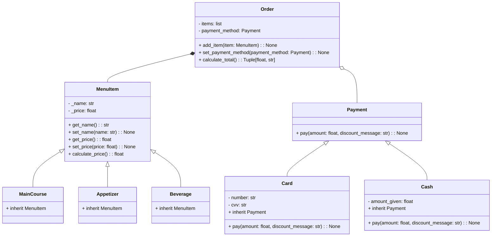

# Shape-of-my-restaurant

_The way I died when I realized this was not for friday... This time I stop using the different names to call the instance atributes, I was making it more tedious._
***
### Better Comments
_This is the how I decided to use the extension._
- #Info related to the program (grey)
- #* Titles (green light)
- #? Advices or clarifications (blue)
- #todo Need to reforce (orange)
- #! Confused bout' something (red)
- #// Discarted (--)
- #- Success (yellow)
***
## 1. Shape
I found this task easier, thanks to all the previous codes. The most challenging part was implementing some mathematical formulas and using all the methods and attributes without getting too lost.
```python
import math
from typing import List


#*Figures and shapes
#Practizing polimorphism and heritance


class Point:
    def __init__(self, x, y):
        self._x = x
        self._y = y

    def get_x(self):
        return self._x

    def get_y(self):
        return self._y

    @staticmethod
    def get_point():
        # Prompt the user to enter the coordinates of a point
        x = float(input("Enter the x-coordinate of the vertex: "))
        y = float(input("Enter the y-coordinate of the vertex: "))
        return Point(x, y)

class Line:
    def __init__(self, start: Point, end: Point):
        self._start = start
        self._end = end

    def get_start(self):
        return self._start

    def get_end(self):
        return self._end

    def compute_length(self):
        length = math.sqrt((self._end.get_x() - self._start.get_x())**2 + (self._end.get_y() - self._start.get_y())**2)
        return abs(length)

class Shape(Line):
    def __init__(self, is_regular: bool, vertices: List[Point], edges: List[Line], inner_angles: List[float], width: float, height: float):
        self._is_regular = is_regular
        self._vertices = vertices
        self._edges = edges
        self._inner_angles = inner_angles
        self._width = width
        self._height = height

    def get_is_regular(self):
        return self._is_regular

    def set_is_regular(self, is_regular):
        self._is_regular = is_regular

    def get_vertices(self):
        return self._vertices

    def set_vertices(self, vertices):
        self._vertices = vertices

    def get_edges(self):
        return self._edges

    def set_edges(self, edges):
        self._edges = edges

    def get_inner_angles(self):
        return self._inner_angles

    def set_inner_angles(self, inner_angles):
        self._inner_angles = inner_angles

    def get_width(self):
        return self._width

    def set_width(self, width):
        self._width = width

    def get_height(self):
        return self._height

    def set_height(self, height):
        self._height = height

    def compute_area(self):
        pass

    def compute_perimeter(self):
        pass

    def compute_inner_angles(self):
        pass

class Triangle(Shape):
    def __init__(self, is_regular: bool, vertices: List[Point], edges: List[Line], inner_angles: List[float]):
        super().__init__(is_regular, vertices, edges, inner_angles, 0, 0)

        self._is_regular = input("Is the triangle regular? (y/n): ") #? If the triangle is regular, then the thiangle is equilateral.
        if self._is_regular == "y":
            self._is_regular = True

            print("\nThis is an equilateral triangle.")

            length = float(input("\nEnter the length of the first edge: "))

            print("\nEnter the coordinates of the first vertex")
            first_vertex = Point.get_point()
            second_vertex = Point(first_vertex.get_x() + length, first_vertex.get_y())
            third_vertex = Point(first_vertex.get_x() + length/2, first_vertex.get_y() + length)

            self._vertices = [first_vertex, second_vertex, third_vertex]
            self._edges = [length, length, length]
            self._inner_angles = [60, 60, 60]

        elif self._is_regular == "n":
            self._is_regular = False
            first_length = float(input("Enter the length of the first edge: "))

            print("\nEnter the coordinates of the first vertex")
            first_vertex = Point.get_point()
            second_vertex = Point(first_vertex.get_x() + first_length, first_vertex.get_y())
            print("\nEnter the coordinates of the third vertex")
            third_vertex = Point.get_point()
            vertices = [first_vertex, second_vertex, third_vertex]

            compute_length = Line.compute_length
            half = (first_vertex.get_x() + first_length) - (first_length / 2) #? This is the half of the base of the triangle.
            if third_vertex.get_x() == half:
                print ("\nThis is an isosceles triangle.")

                second_length = compute_length(Line(first_vertex, third_vertex))
                third_length = second_length

                self._vertices = [first_vertex, second_vertex, third_vertex]
                self._edges = [first_length, second_length, third_length]

                self._inner_angles = [0, 0, 0]
                self._inner_angles[0] = math.degrees(math.acos((first_length**2 - second_length**2 - third_length**2) / (-2 * second_length * third_length)))
                self._inner_angles[1] = self._inner_angles[0]
                self._inner_angles[2] = 180 - self._inner_angles[0] * 2

            elif third_vertex.get_x() != half and third_vertex.get_x() != first_vertex.get_x():
                print("\nThis is a scalene triangle.")
                second_length = compute_length(Line(first_vertex, third_vertex))
                third_length = compute_length(Line(second_vertex, third_vertex))
                self._vertices = [first_vertex, second_vertex, third_vertex]
                self._edges = [first_length, second_length, third_length]

                self._inner_angles = [0, 0, 0]
                self._inner_angles[0] = math.degrees(math.acos((first_length**2 - second_length**2 - third_length**2) / (-2 * second_length * third_length)))
                self._inner_angles[1] = math.degrees(math.acos((second_length**2 - first_length**2 - third_length**2) / (-2 * first_length * third_length)))
                self._inner_angles[2] = math.degrees(math.acos((third_length**2 - first_length**2 - second_length**2) / (-2 * first_length * second_length)))
            else:
                third_vertex.get_x() != half and third_vertex.get_x() == first_vertex.get_x()
                print("\nThis is a right triangle.")
                second_length = compute_length(Line(first_vertex, third_vertex))
                third_length = math.sqrt(first_length**2 + second_length**2)
                self._vertices = [first_vertex, second_vertex, third_vertex]
                self._edges = [first_length, second_length, third_length]

                self._inner_angles = [0, 0, 0]
                self._inner_angles[0] = 90
                self._inner_angles[1] = math.degrees(math.atan(first_length / third_length))
                self._inner_angles[2] = math.degrees(math.atan(second_length / third_length))

    def compute_perimeter(self):
        return sum(self._edges)

    def compute_area(self): #? This is the Heron's formula.
        s = self.compute_perimeter() / 2
        return math.sqrt(s * (s - self._edges[0]) * (s - self._edges[1]) * (s - self._edges[2]))

    def __str__(self):
        vertices_str = ", ".join([f"({v.get_x()}, {v.get_y()})" for v in self._vertices])
        edges_str = ", ".join([f"{ed}" for ed in self._edges])
        angles_str = ", ".join([f"{angles}" for angles in self._inner_angles])
        permiter = self.compute_perimeter()
        area = self.compute_area()
        return f"\nTriangle: \nVertices: {vertices_str}\n\nEdges: {edges_str}\n\nInner Angles: {angles_str}\n\nPerimeter: {permiter}\n\nArea: {area}"

class Rectangle(Shape):
    def __init__(self, is_regular: bool, vertices: List[Point], edges: List[Line], inner_angles: List[float], width: float, height: float):
        super().__init__(is_regular, vertices, edges, inner_angles, width, height)
        self._width = width
        self._height = height
        self._vertices = vertices
        self._edges = edges
        self._inner_angles = inner_angles

        self._is_regular = input("\nIs the rectangle regular? (y/n): ") #? If the rectangle is regular, then the rectangle is a square.
        if self._is_regular == "y":
            self._is_regular = True

            print("\nThis is a square.")
            length = float(input("Enter the length of one side: "))
            print("Enter the coordinates of the first vertex")
            first_vertex = Point.get_point()

            second_vertex = Point(first_vertex.get_x() + length, first_vertex.get_y())
            third_vertex = Point(first_vertex.get_x(), first_vertex.get_y() + length)
            fourth_vertex = Point(first_vertex.get_x() + length, first_vertex.get_y() + length)

            self._vertices = [first_vertex, second_vertex, third_vertex, fourth_vertex]
            self._edges = [length, length, length, length]
            self._inner_angles = [90, 90, 90, 90]
            self._width = length
            self._height = length

        elif self._is_regular == "n":
            self._is_regular = False

            width = float(input("\nEnter the width of the rectangle: "))
            height = float(input("Enter the height of the rectangle: "))

            print("\nEnter the coordinates of the first vertex: ")
            first_vertex = Point.get_point()
            second_vertex = Point(first_vertex.get_x() + width, first_vertex.get_y())
            third_vertex = Point(first_vertex.get_x(), first_vertex.get_y() + height)
            fourth_vertex = Point(first_vertex.get_x() + width, first_vertex.get_y() + height)

            self._vertices = [first_vertex, second_vertex, third_vertex, fourth_vertex]
            self._edges = [width, width, height, height]
            self._inner_angles = [90, 90, 90, 90]
            self._width = width
            self._height = height

    def compute_perimeter(self):
        return sum(self._edges)

    def compute_area(self):
        return self._width * self._height

    def __str__(self):
        vertices_str = ", ".join([f"({v.get_x()}, {v.get_y()})" for v in self._vertices])
        edges_str = ", ".join([f"{ed}" for ed in self._edges])
        angles_str = ", ".join([f"{angles}" for angles in self._inner_angles])
        perimeter = self.compute_perimeter()
        area = self.compute_area()
        return f"Rectangle: \nVertices: {vertices_str}\n\nEdges: {edges_str}\n\nInner Angles: {angles_str}\n\nPerimeter: {perimeter}\n\nArea: {area}"

triangle = Triangle(True, [], [], [])
print(triangle)

rectangle = Rectangle(True, [], [], [], 0, 0)
print(rectangle)
```
___
## 2. Dante's Inferno
I wanted to create a restaurant named after my dog, Dante. The menu is inspired by my personal preferences and pricing experiences. I had to devise strategies to make the code more concrete. In this opportunity, I found it a little bit harder to implement the private and protected stuff when adding the payment methods.

```python

#* Restarurant - Dante's Inferno
# I am going to create a program that allows the customer to know how much money they have to pay.

class MenuItem:
    def __init__(self, name, price):
        self._name = name
        self._price = price

    def get_name(self):
        return self._name

    def set_name(self, name):
        self._name = name

    def get_price(self):
        return self._price

    def set_price(self, price):
        self._price = price

    def calculate_price(self):
        return self._price


class MainCourse(MenuItem):
    pass


class Appetizer(MenuItem):
    pass


class Beverage(MenuItem):
    pass


class Order(MenuItem):
    def __init__(self):
        self.items = []
        self.payment_method = None

    def add_item(self, item):
        self.items.append(item)

    def set_payment_method(self, payment_method):
        self.payment_method = payment_method

    def calculate_total(self):
        #? Define discount items and their corresponding discount percentages
        hot_discount_items = ["Hot wings", "Mini nachos", "Coke"]
        la_discount_items = ["Tacos de birria", "Mini empanadas", "Peach Tea"]
        ita_discount_items = ["Pepperoni slice pizza", "French bread", "Coconut lemonade"]
        thirsty_discount_items = ["Coconut lemonade", "Coke", "Mango juice", "Peach Tea"]

        hot_discount = 0.05
        la_discount = 0.03
        ita_discount = 0.06
        thirsty_discount = 0.07

        total_price = sum(item.calculate_price() for item in self.items)

        item_names = [item.get_name() for item in self.items]

        discount = 0
        discount_message = "You did not get a discount for this purchase"

        #? Check if all items in the order match the discount items
        if all(item in item_names for item in hot_discount_items):
            discount = total_price * hot_discount
            discount_message = "5% Hot discount applied."
        elif all(item in item_names for item in la_discount_items):
            discount = total_price * la_discount
            discount_message = "3% La discount applied."
        elif all(item in item_names for item in ita_discount_items):
            discount = total_price * ita_discount
            discount_message = "6% Ita discount applied."
        elif all(item in item_names for item in thirsty_discount_items):
            discount = total_price * thirsty_discount
            discount_message = "7% Thirsty discount applied."

        total_price -= discount

        if self.payment_method:
            self.payment_method.pay(total_price, discount_message)

        return total_price, discount_message


# Payment classes
class Payment:
    def __init__(self):
        pass

    def pay(self, amount, discount_message):
        raise NotImplementedError("Subclasses must implement pay()")


class Card(Payment):
    def __init__(self, number, cvv):
        super().__init__()
        self.number = number
        self.cvv = cvv

    def pay(self, amount, discount_message):
        print(f"Processing payment of ${amount} with card ending in {self.number[-4:]}")
        print(f"Discount: {discount_message}")


class Cash(Payment):
    def __init__(self, amount_given):
        super().__init__()
        self.amount_given = amount_given

    def pay(self, amount, discount_message):
        if self.amount_given >= amount:
            print(f"Payment completed in cash. Change: ${self.amount_given - amount}") #? This is the change that the customer will receive.
            print(f"Discount: {discount_message}")
        else:
            print(f"Insufficient funds. ${amount - self.amount_given} needed to complete the payment.") 
            #? This is the amount of money that the customer needs to complete the payment.


# Define menu items
menu = [
    MainCourse("Pepperoni slice pizza", 7000),
    MainCourse("Hot wings", 15000),
    MainCourse("Tacos de birria", 15000),
    Appetizer("French bread", 4000),
    Appetizer("Mini nachos", 12000),
    Appetizer("Mini empanadas", 8000),
    Beverage("Coconut lemonade", 8000),
    Beverage("Coke", 6000),
    Beverage("Mango juice", 7000),
    Beverage("Peach Tea", 6000),
]

def display_menu():
    print("\nMenu:")
    for i, item in enumerate(menu, start=1):
        if isinstance(item, MainCourse):
            category = "Main Course"
        elif isinstance(item, Appetizer):
            category = "Appetizer"
        elif isinstance(item, Beverage):
            category = "Beverage"
        else:
            category = "Unknown"
        print(f"{i}. {item.get_name()} - ${item.get_price()} ({category})")

def get_order():
    order = Order()
    display_menu()

    while True:
        choice = input("\nEnter the number of the item you'd like to order (or 'q' to finish): ") 
        #? This is the input that the customer will use to choose the items.
        if choice.lower() == 'q':
            break
        try: #? This was suggested by Copilot to handle the exceptions.
            choice_idx = int(choice) - 1
            if choice_idx < 0 or choice_idx >= len(menu):
                raise ValueError
            order.add_item(menu[choice_idx])
        except (ValueError, IndexError):
            print("\nInvalid choice. Please try again.")

    total_price, discount_message = order.calculate_total()
    print(f"\nTotal amount to pay: ${total_price}\n\nDiscount: {discount_message}")

    payment_choice = input("\nChoose payment method (1. Card, 2. Cash): ")
    if payment_choice == "1":
        card_number = input("Enter card number: ")
        cvv = input("Enter CVV: ")
        order.set_payment_method(Card(card_number, cvv))
    elif payment_choice == "2":
        amount_given = float(input("Enter amount given: "))
        order.set_payment_method(Cash(amount_given))
    else:
        print("Invalid payment method. Payment not completed.")

    return order

print("Welcome to Dante's Inferno!")
order = get_order()
total, discount_message = order.calculate_total()
print("Have a bloody good day!")
```
Discounts:
Hot discount - When ordering hot wings, mini nachos and Coke, the order will have a 5% total discount.
La discount - When ordering tacos de birria, mini empanadas and peach tea, the order will have a 3% total discount.
Ita discount - When ordering pepperoni pizza, French bread and coconut lemonade, the order will have a 6% total discount.
Thirsty discount - When ordering coconut lemonade, coke, mango juice and peach tea.

***
# Mermaid - Dante's inferno
***

___
### That was it. Thanks for reading...
